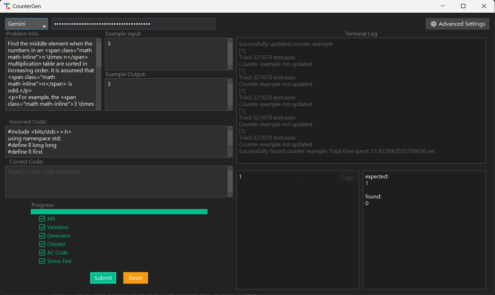

# CounterGen

CounterGen is an LLM-assisted platform that helps problem solvers automatically generate counter-examples for their buggy programs.



## Motivation

As every programmer knows, a counter-example is one of the most effective tools for debugging. However, many competitive programming platforms only provide a simple "Wrong Answer" verdict without showing the actual failing testcase.

Even when a failing testcase is provided, it is often a large, randomized input that is difficult for humans to interpret. This leaves problem solvers without meaningful insights to fix their code.

Our goal is to provide coders with minimal, human-readable counter-examples that immediately highlight the bugs.

## Project description

CounterGen leverages LLM APIs (Gemini, Claude, and OpenAI) to automatically generate and execute programs that perform stress testing against user submissions.

We have also designed an automated workflow to test these generated programs in every stage, ensuring they function as intended.

The workflow is summarized in the following diagram:


## How To Run

### Prerequisite Environment

* Python 3.9+

* g++ (required to run user-provided C++ programs)

### API Key

You would need a API key to enable LLM supports.
We supports 3 options: Gemini, Claude and OpenAI.

It is recommended to start with Gemini, since it offers a free plan: 👉[Get Gemini API Key](https://aistudio.google.com/apikey)

### Setup Guide

1. Clone the repository
```
git clone https://github.com/cloud1204/CounterGen.git
cd CounterGen
```
2. (Optional) Create a virtual environment
```
python3 -m venv .venv
source .venv/bin/activate        # Linux/macOS
# .venv\Scripts\activate.bat     # Windows
```
3. Install dependencies
```
pip install -r requirements.txt
```
4. Run the UI
```
python UI.py
```

## UI Instructions

### Input sections

* Problem Statements

    Paste the full problem statement here.
    It is recommended to include the complete LaTeX text to preserve mathematical formatting.

    * Codeforces users: Right-click the problem page → View Page Source → copy & paste the source code. We will automatically parse the statement and example testcases.

    * CSES/AtCoder users: You can simply paste the problem URL, and we will parse the statement and example testcases for you.

* Example Input/Output

    An example testcase is required to verify the correctness of the Validator, Checker, and AC (Accepted) code.

* Failed Code

    The buggy code for which you want to find a counter-example.
    Currently, we support C++ and Python.

* Correct Code (Optional)

    A correct solution used in stress testing.
    This field may be left empty, but if provided, it can reduce the time needed for the LLM to generate results.
    Currently, we support C++ and Python.

### Execution

* Progress will be displayed in the progress bar.
* Detailed logs will be shown in the log box.
* Once finished, the generated counter-example will appear in the lower-right textboxes, along with the checker's output.

### Advanced Settings

You can choose different model options for each stage of the process.

* For hard problems, it is recommended to use stronger models to generate the AC code.
* For other situations, lighter models are preferred, as they offer faster speed.